## 2.互联网核心部分（通信作用）

**在网络核心部分起特殊作用的是路由器** (router)。

- **路由器是实现分组交换** **(packet switching)** 的关键构件，其任务是转发收到的分组，这是网络核心部分最重要的功能。

### 2.1电路交换

每一部电话都直接连接到交换机上，而交换机使用交换的方法，让电话用户彼此之间可以很方便地通信。 所采用的交换方式就是电路交换 (circuit switching)。

> 电路交换特点：

- 电路交换必定是==面向连接==的。 
- 电路交换分为三个阶段：
  - ==建立连接==：建立一条专用的物理通路，以保证双方通话时所需的通信资源在通信时不会被其他用户占用；
  - ==通信==：主叫和被叫双方就能互相通电话；
  - ==释放连接==：释放刚才使用的这条专用的物理通路（释放刚才占用的所有通信资源）。

- 电路交换的用户始终占用端到端的通信资源

> 缺点：

- 计算机数据具有突发性；
- 这导致在传送计算机数据时，通信线路的利用率很低（用来传送数据的时间往往不到10%甚至1% ）。

### 2.2分组交换（提高效率，每段只占用很短时间）

- 分组交换则采用==存储转发==技术。
- 在发送端，先把较长的报文==划分成较短的、固定长度的数据段==。

> 添加首部构成分组：

每一个数据段前面添加上==首部==构成分组(packet)。

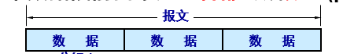

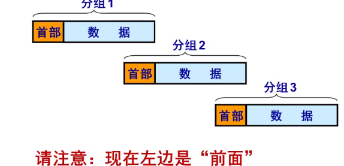

- 每一个分组的首部都含有地址（诸如目的地址和源地址）等控制信息。

> 收到分组后剥去首部

- 接收端收到分组后剥去首部还原成报文。

> **分组交换，存储转发：**

- 在路由器中的输入和输出端口之间没有直接连线。
- **路由器**处理分组的过程是：
  - 把收到的分组先==放入缓存（暂时存储）；==
  - ==查找转发表==，找出到某个目的地址应从哪个端口转发；
  - 把分组送到适当的端口==转发==出去。 

对象是分组，工作方式是存储转发。

>  主机和路由器的作用不同：

- 主机是为用户进行信息处理的，并向网络发送分组，从网络接收分组。
- 路由器对分组进行存储转发，最后把分组交付目的主机。

> ==**分组交换优点**==

> **分组交换带来的问题**

- 分组在各结点存储转发时需要排队，这就会造成一定的时延。 
- 分组必须携带的首部（里面有必不可少的控制信息）也造成了一定的开销。 

> **三种交换的比较**

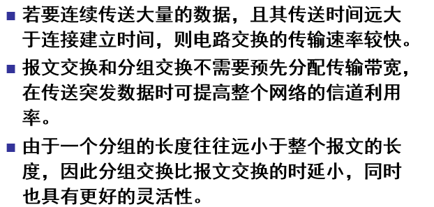

# 三、计算机网络的类别

计算机网络：联通+共享

## 1.按照作用范围分类

- ==广域网 WAN (Wide Area Network)：==作用范围通常为几十到几千公里。
- ==城域网 MAN (Metropolitan Area Network)：==作用距离约为  5 ~ 50 公里。
- ==局域网 LAN (Local Area Network) ：==局限在较小的范围（如 1 公里左右）。
- 个人区域网 PAN (Personal Area Network) ：范围很小，大约在 10 米左右。

## 2.按照网络的使用者进行分类

- 公用网 (public network) 
  按规定交纳费用的人都可以使用的网络。因此也可称为公众网。
- 专用网 (private network) 
  为特殊业务工作的需要而建造的网络。

## 3.用来把用户接入到互联网的网络

- 接入网 AN (Access Network)，它又称为本地接入网或居民接入网
- 接入网是一类比较特殊的计算机网络，用于将用户接入互联网。
- 接入网本身既不属于互联网的核心部分，也不属于互联网的边缘部分。
- 接入网是从某个用户端系统到互联网中的第一个路由器（也称为边缘路由器）之间的一种网络。

# 四、计算机网络的性能

## 1.计算机网络的性能指标

### 1.1 速率

- ==比特（bit）==是计算机中数据量的单位，也是信息论中使用的信息量的单位。
- 比特（bit）来源于 binary digit，意思是一个“二进制数字”，因此一个比特就是二进制数字中的一个 1 或 0。
- ==速率==是计算机网络中最重要的一个性能指标，==指的是数据的传送速率==，它也称为==数据率 (data rate)==或==比特率 (bit rate)==。
- 速率的==单位==是 bit/s，或 kbit/s、Mbit/s、 Gbit/s 等。例如 4 X10^10^ bit/s 的数据率就记为 40 Gbit/s。
- ==速率往往是指额定速率或标称速率，非实际运行速率。== 

### 1.2 带宽

> 两种不同意义：

- “带宽”(bandwidth) 本来是指信号具有的==频带宽度==，其单位是赫（或千赫、兆赫、吉赫等）。
- 在计算机网络中，带宽用来表示==网络中某通道传送数据的能力==。表示在单位时间内网络中的某信道所能通过的==“最高数据率”==。单位是 bit/s ，即 “比特每秒”。

- 在“带宽”的上述两种表述中，前者为频域称谓，而后者为时域称谓，其本质是相同的。也就是说，一条通信链路的“带宽”越宽，其所能传输的“最高数据率”也越高。

### 1.3 吞吐量

- 吞吐量 (throughput) 表示在单位时间内通过某个网络（或信道、接口）的数据量。
- 吞吐量更经常地用于对现实世界中的网络的一种测量，以便知道==实际上到底有多少数据量能够通过网络。==
- ==吞吐量受网络的带宽或网络的额定速率的限制==。  

### 1.4  时延 (delay 或 latency)

- 时延 (delay 或 latency) 是指数据（一个报文或分组，甚至比特）从网络（或链路）的一端传送到另一端所需的时间。
- 有时也称为==延迟或迟延==。
- 网络中的时延由以下几个不同的部分组成：
  - (1) 发送时延
  - (2) 传播时延
  - (3) 处理时延
  - (4) 排队时延

> 发送时延:

- 也称为传输时延。
- 发送数据时，数据帧从结点进入到传输媒体所需要的时间。
- 也就是从发送数据帧的第一个比特算起，到该帧的最后一个比特发送完毕所需的时间。 

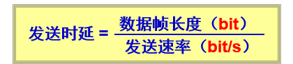

> 传播时延

- 电磁波在信道中需要传播一定的距离而花费的时间。 
- 发送时延与传播时延有本质上的不同。
- 信号发送速率和信号在信道上的传播速率是完全不同的概念。 

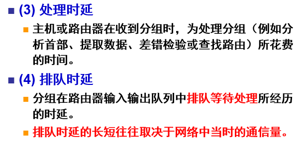

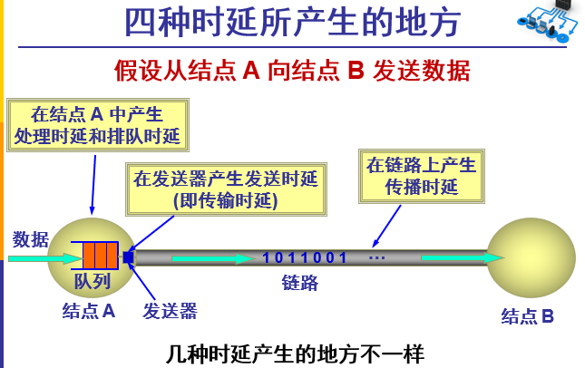

### 1.5 时延带宽积

### 1.6 往返时间 RTT

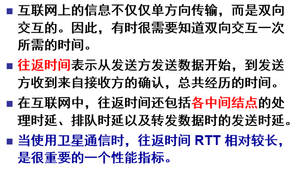

### 1.7 利用率

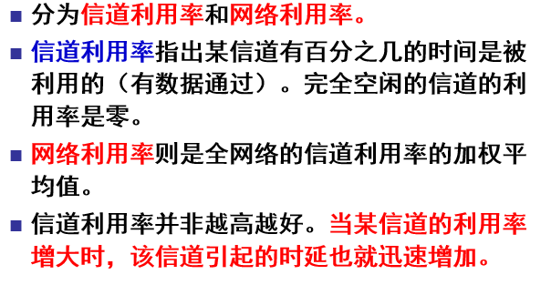

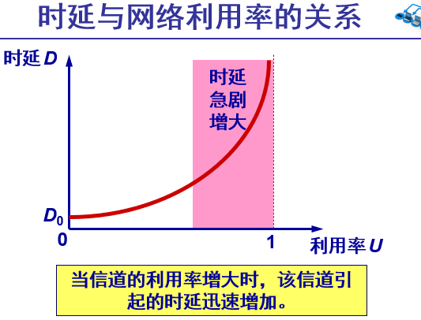

## 2.计算机网络的非性能特征 

费用
质量
标准化
可靠性
可扩展性和可升级性 
易于管理和维护 

# 五、计算机网络体系结构（分组交换形式）

## OSI/RM七层模型，没有被使用

## TCP/IP四层模型

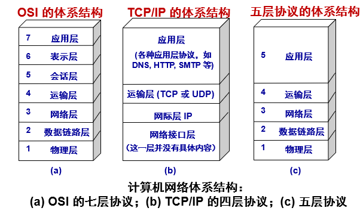

## 分层的依据

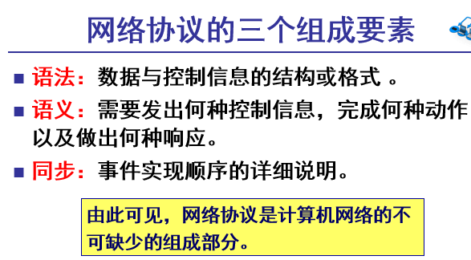

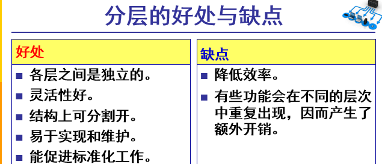

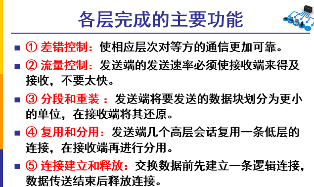

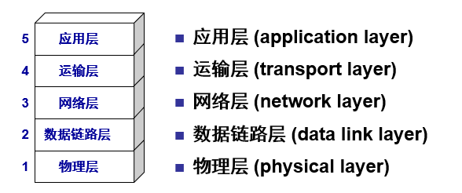

## 数据传输流程（五层模型）

> 需要下层为上层提供服务：

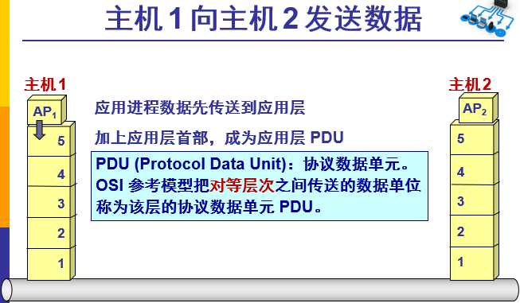

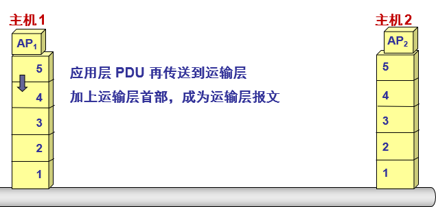

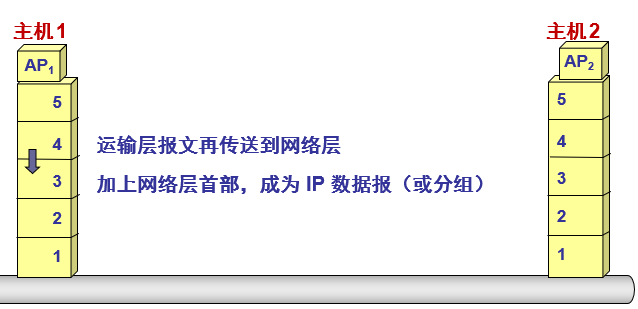

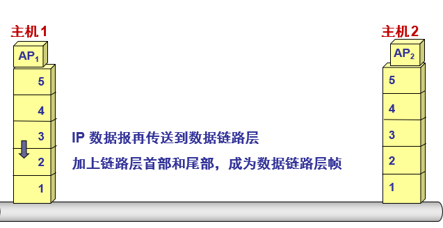

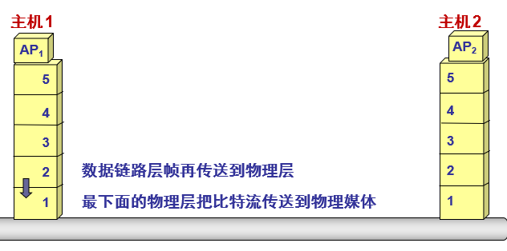

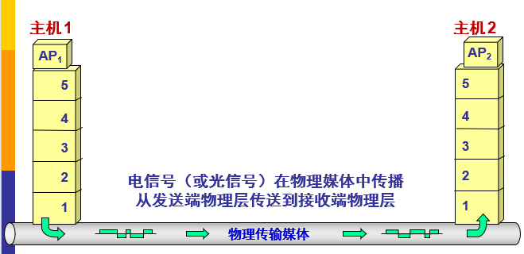

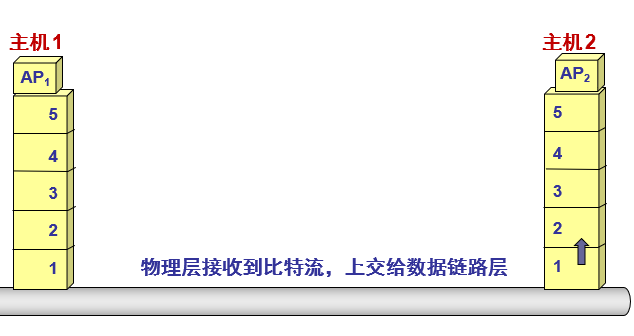

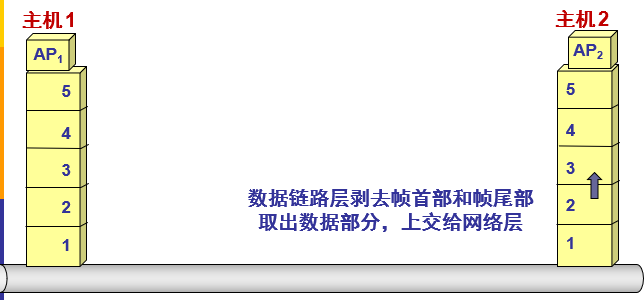

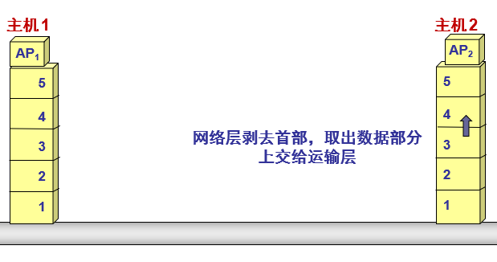

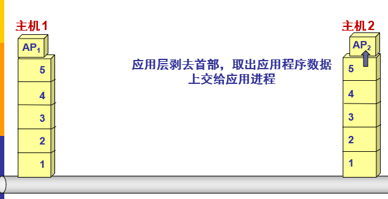

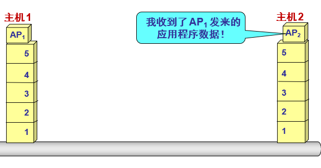

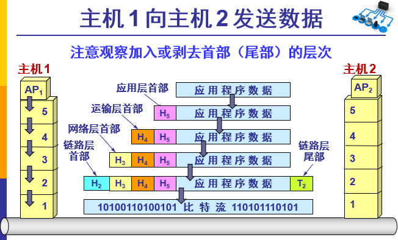

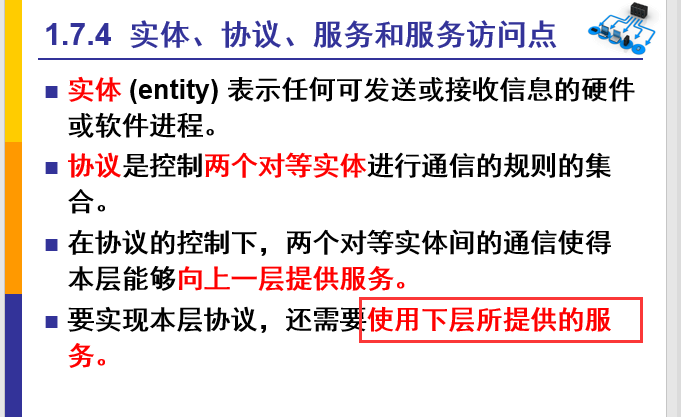

## 协议和服务

- 协议的实现保证了能够向上一层提供服务。
- 本层的服务用户==只能看见服务==而无法看见下面的协议。即==下面的协议对上面的服务用户是透明的==。 
- 协议是“==水平的==”，即协议是控制对等实体之间通信的规则。
- 服务是“==垂直的==”，即服务是由下层向上层通过层间接口提供的。
- 上层使用==服务原语==获得下层所提供的服务。

# 六、物理层

## 物理层基本概念

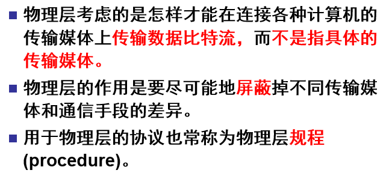

### 主要任务

确定与传输媒体的接口的一些特性。

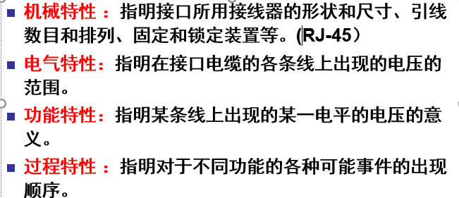

## 数据通信的基础知识

### 数据通信系统的模型

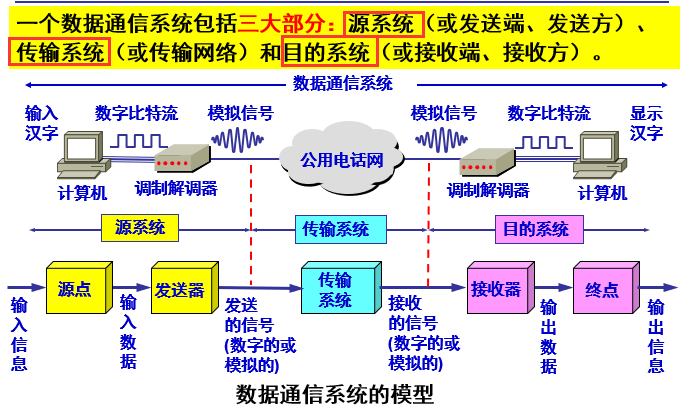

### 常用术语

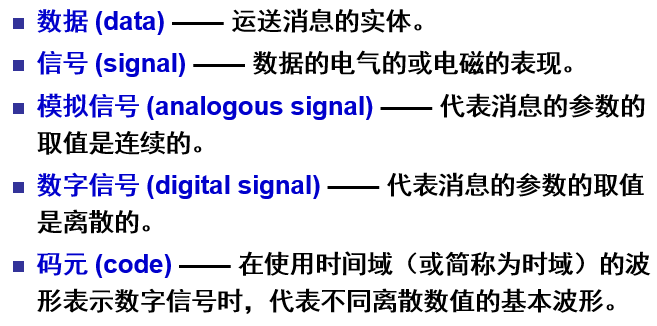

### 有关信道的基本概念

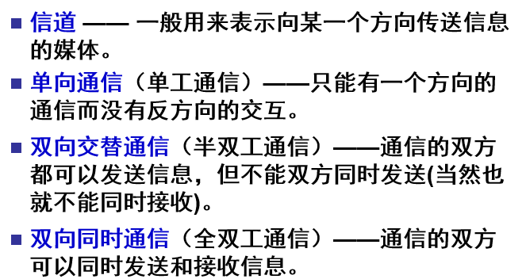

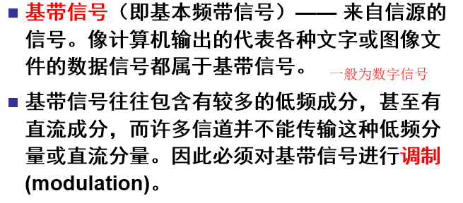

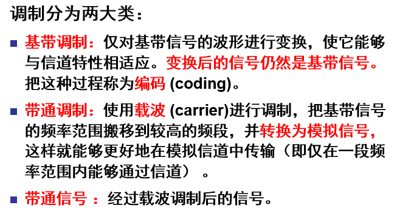

### 常用的编码（基带调制）方式

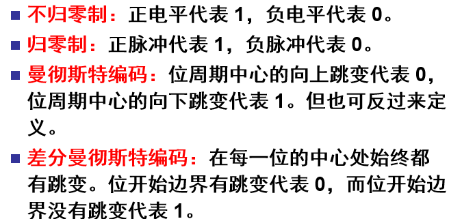

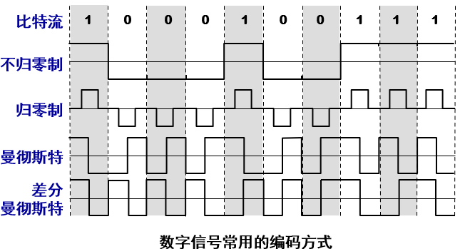

### 基本的带通调制方法

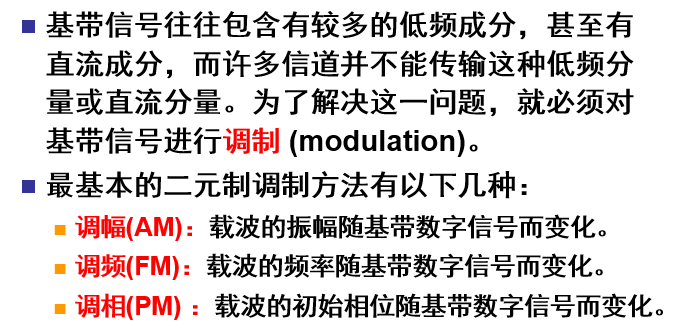

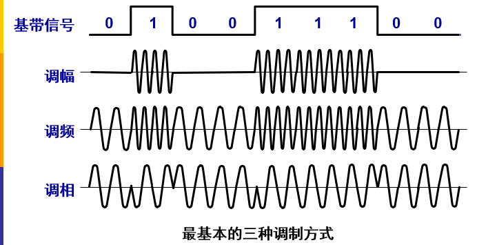

### 信道的极限容量

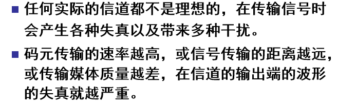

#### 与==信道能够通过的频率范围==有关

- 奈奎斯特 (Nyquist) 就推导出了著名的奈氏准则。他给出了在假定的理想条件下，为了避免码间串扰，码元的传输速率的上限值。

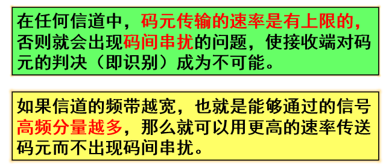

#### 信噪比

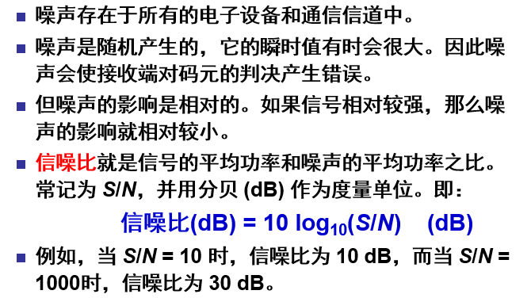

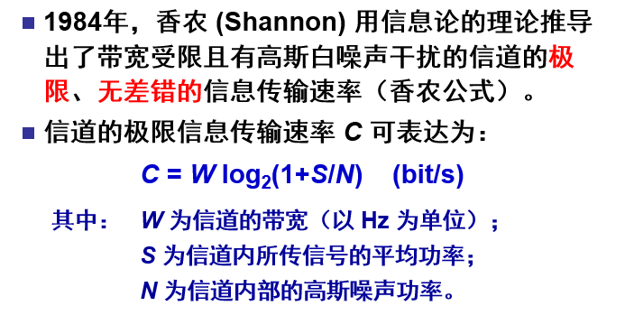

## 物理层下面的传输媒体

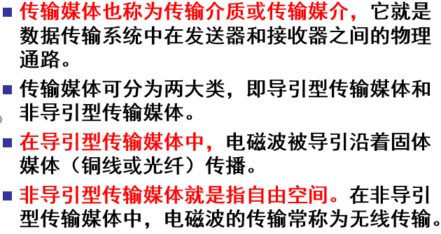

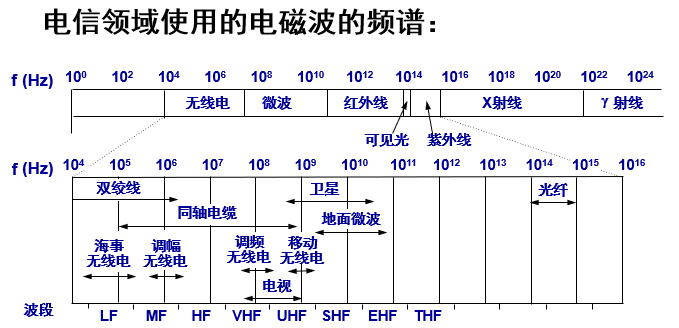

### 引导型传输媒体

#### 双绞线

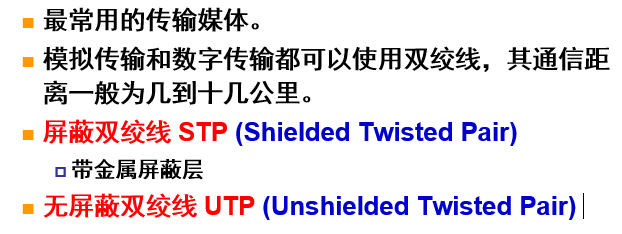

#### 同轴电缆

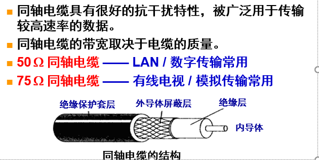

#### 光缆

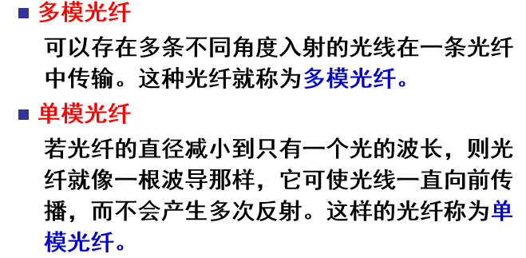

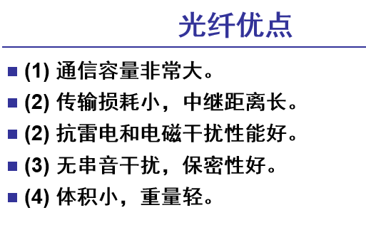

### 非导引型传输媒体 

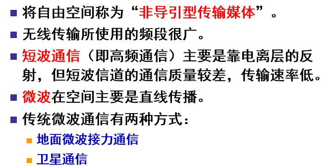

## 信道复用技术

### 频分复用、时分复用和统计时分复用

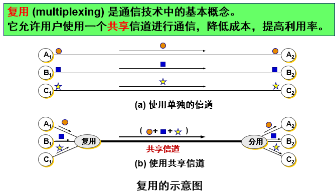

### 波分复用

### 码分复用 CDM

全是-1或者1相乘再加

分别用码片序列进行规格化内积：A:1,B:0,C没有发生，D:1

# 七、数据链路层（不能实现可靠传输；是同一网络中连接，不同怎么办？）

## 数据链路层使用的信道

每一个层次感觉在和其他同层直接交流，但是实际上是下层在提供服务，而且本层也对上层进行服务。

## 使用点对点信道的数据链路层

### 数据链路和帧

### 三个基本问题

#### 封装成帧

#### 透明传输（也就是不关系它怎么传输）

#### 差错检测

##### CRC技术

## 点对点协议PPP

### PPP 协议的特点

#### PPP 协议应满足的需求 

#### PPP 协议不需要的功能

#### PPP 协议的组成 

### PPP 协议的帧格式

### PPP 协议的工作状态 

## 使用广播信道的数据链路层

### 局域网的数据链路层 

#### 媒体共享技术

#### 以太网的两个标准  

#### 数据链路层的两个子层

#### 适配器

### CSMA/CD 协议 

#### 以太网两种重要措施

##### 无连接工作方式

##### 发送的数据采用曼切斯特编码

#### CSMA/CD协议 含义

##### 载波监听

##### 多点接入

##### 碰撞检测

#### CSMA/CD 重要特性

#### 争用期

#### 二进制指数类型退避算法 

#### 争用期的长度 

#### 最短有效帧长 

#### 强化碰撞

#### CSMA/CD协议的要点

==**先听后发，边听边发，冲突停止，延迟重发**==

### 使用集线器的星形拓扑

#### 星形以太网 10BASE-T 

#### 集线器的一些特点 

### 以太网的信道利用率 

#### 对以太网参数 α 的要求

#### 信道利用率的最大值 Smax 

### 以太网的 MAC 层

#### MAC 层的硬件地址 

#### MAC 帧的格式 

##### ==最大1518个字节（B）= 1500 + 6 +6 +2+4==

##### 最短46B：需要有64B的争用期，64-18=46B

**数据字段的正式名称是 MAC 客户数据字段。**

#### 无效的 MAC 帧 

#### 帧间最小间隔 

## 扩展的以太网（为了解决冲突）

### 在物理层扩展以太网

#### 使用光纤扩展

传输数据更远

#### 使用集线器扩展

### 在数据链路层扩展以太网 （解决了碰撞冲突问题）

#### 以太网交换机的特点

#### 以太网交换机的优点

#### 以太网交换机的交换方式

#### 以太网交换机的自学习功能

#### 交换机使用了生成树协议 （避免环状结构）

### 虚拟局域网

# 八、网络层（不保证可靠传输；实现尽最大努力交付；实现不同网络连接（路由器实现））

## 网络层提供的两种服务

### 一种观点：让网络负责可靠交付 

>  通过虚电路实现，但会占用大量资源，不适用

### 另一种观点：网络提供数据报服务（采用）

==可靠性传输靠端系统保证==

### 虚电路服务与数据报服务的对比

## 网际协议 IP

### 虚拟互连网络 —（IP网）

#### 如何将异构的网络互相连接起来？

##### 使用一些中间设备进行互连 —路由器

#### 虚拟互连网络的意义 

### 分类的 IP 地址

#### IP 地址及其表示方法 

#### 分类 IP 地址 

- ==网络号+主机号组成==（是唯一的）

网络号 net-id，它标志主机（或路由器）所连接到的网络，而另一个字段则是主机号 host-id，它标志该主机（或路由器）。

#### ==点分十进制记法==

最大为255，最小为0

#### 常用的三种类别的 IP 地址 

#### IP 地址的一些重要特点 

>  注意：

- 在同一个局域网上的主机或路由器的IP 地址中的网络号必须是一样的。图中的网络号就是 IP 地址中的 net-id。

- 路由器总是具有两个或两个以上的 IP 地址。路由器的每一个接口都有一个不同网络号的 IP 地址。

### IP 地址与硬件地址

>  ==mac地址一直在变，IP地址一直不变；==

### 地址解析协议 ARP—找到相应硬件地址

#### 地址解析协议 ARP 要点

#### ARP 高速缓存的作用

#### 使用 ARP 的四种典型情况 

主机到主机；主机到路由器；路由器到主机；路由器到路由器。

#### 什么？不直接使用硬件地址进行通信？ 

### ==IP 数据报的格式==

20个字节160比特位，对应下面：

- 标志(flag) ——占 3 位，目前只有前两位有意义。标志字段的最低位是 MF (More Fragment)。
  MF =1 表示后面“还有分片”。MF = 0 表示最后一个分片。
  标志字段中间的一位是 DF (Don't Fragment) 。
  只有当 DF = 0 时才允许分片。 
- 片偏移——占13 位，指出：较长的分组在分片后某片在原分组中的相对位置。片偏移以 8 个字节为偏移单位。

- ==生存时间==——占8 位，记为 TTL (Time To Live)，指示数据报在网络中可通过的路由器数的最大值。

- 协议—占8 位，指出此数据报携带的数据使用何种协议，以便目的主机的 IP 层将数据部分上交给那个处理过程。

- 首部检验和——占16 位，==只检验数据报的首部，不检验数据部分==。这里不采用 CRC 检验码而采用简单的计算方法。 
  - IP 数据报首部检验和的计算采用 16 位==二进制反码求和算法==

### IP 层转发分组的流程 

- 路由表指出，到某个网络应当先到某个路由器（即下一跳路由器）。

#### 默认路由

- 路由器还可采用默认路由以减少路由表所占用的空间和搜索路由表所用的时间。其他路由没有对应映射表的规则，就转发到这个默认路由进行寻找。

#### ==一些注意==

#### 路由器分组转发算法

## 划分子网和构造超网

### 划分子网

#### 从两级 IP 地址到三级 IP 地址 

#### 子网掩码（为了得到多少为代表子网号，多少位代表主机号）

- 问题：==从一个 IP 数据报的首部并无法判断源主机或目的主机所连接的网络是否进行了子网划分。==

- 子网掩码是一个网络或一个子网的重要属性。

#### 子网划分方法

#### 注意

- 有了子网掩码后，IP地址和子网掩码需要同时出现，得到网络地址

### 使用子网时分组的转发

#### 现在判断是否是同一网络标准

- 掩码是否一样
- 掩码和IP地址做与运算，运算出来结果（网络地址）是否一样。

### 无分类编址 CIDR

##### CIDR 最主要的特点 

##### 无分类的两级编址 

##### 路由聚合 (route aggregation) 

#### 最长前缀匹配

## 网际控制报文协议 ICMP

### ICMP 报文的种类

#### ICMP 差错报告报文

#### ICMP 询问报文

### ICMP 的应用举例

## 互联网的路由选择协议

### 分层次的路由选择协议

### 内部网关协议 RIP（选择距离短的；**好消息传播得快，坏消息传播得慢**）

#### RIP 协议的三个特点 

#### 距离向量算法更新路由表（看ppt178页）

#### RIP2 协议的报文格式 

#### RIP 协议的优缺点 

### 内部网关协议 OSPF（开放最短路径优先）

#### 基本特点

### 外部网关协议 BGP

### 路由器的构成

## IPv6

## IP 多播

### 网际组管理协议 IGMP 

## 多协议标记交换 MPLS

为了加快速度，减少查表时间

# 九、运输层（提供应用进程间的逻辑通信）

## 运输层协议概述

### 进程之间的通信

#### 运输层的作用

### 运输层的两个主要协议

### 运输层的端口 

#### 两大类端口

## 用户数据报协议 UDP（不合并，不拆分，一次发送一个完整报文）

### UDP概述

#### UDP 的主要特点 

### UDP 的首部格式 

- 在计算检验和时，临时把“伪首部”和 UDP 用户数据报连接在一起。==伪首部仅仅是为了计算检验和==，为了保证目的地址和发送地址正确。发送时就丢弃。

## 传输控制协议 TCP 概述

### TCP 最主要的特点

### TCP 面向流的概念 

### TCP 的连接 

## 可靠传输的工作原理

### 停止等待协议（超时重传）

- **无差错情况**

- 出现差错-超时重传

- 确认丢失和确认迟到

### 连续 ARQ 协议

## TCP 报文段的首部格式

- 序号字段——占 4 字节。TCP 连接中传送的数据流中的每一个字节都编上一个序号。序号字段的值则指的是本报文段所发送的数据的第一个字节的序号。 

- 序号字段——占 4 字节。TCP 连接中传送的数据流中的每一个字节都编上一个序号。序号字段的值则指的是本报文段所发送的数据的第一个字节的序号。 
- 确认号字段（ack）——占 4 字节，是期望收到对方的下一个报文段的数据的第一个字节的序号。

- 数据偏移（即首部长度）——占 4 位，它指出 TCP 报文段的数据起始处距离 TCP 报文段的起始处有多远。“数据偏移”的单位是 32 位字（以 4 字节为计算单位）。  

- 紧急 URG —— 当 URG = 1 时，表明紧急指针字段有效。它告诉系统此报文段中有紧急数据，应尽快传送(相当于高优先级的数据)。 

- 确认 ACK —— 只有当 ACK =1 时确认号字段才有效。当 ACK = 0 时，确认号无效。 
- 推送 PSH (PuSH) —— 接收 TCP 收到 PSH = 1 的报文段，就尽快地交付接收应用进程，而不再等到整个缓存都填满了后再向上交付。  
- 复位 RST (ReSeT) —— 当 RST  1 时，表明 TCP 连接中出现严重差错（如由于主机崩溃或其他原因），必须释放连接，然后再重新建立运输连接。 
- 同步 SYN —— 同步 SYN = 1 表示这是一个连接请求或连接接受报文。 
- 终止 FIN (FINish) —— 用来释放一个连接。FIN = 1 表明此报文段的发送端的数据已发送完毕，并要求释放运输连接。 
- 窗口字段 —— 占 2 字节，用来让对方==设置发送窗口==的依据，单位为字节。

- 检验和 —— 占 2 字节。检验和字段检验的范围包括首部和数据这两部分。在计算检验和时，要在 TCP 报文段的前面==加上 12 字节的伪首部。==

## TCP 可靠传输的实现

### 以字节为单位的滑动窗口

### 超时重传时间的选择

### 选择确认 SACK

## TCP 的流量控制

### 利用滑动窗口实现流量控制

### 必须考虑传输效率

## TCP 的拥塞控制（数据量太多造成）

### 拥塞控制的一般原理

### TCP 的拥塞控制方法（基于窗口）

#### TCP拥塞控制算法

#### 主动队列管理 AQM

## TCP 的运输连接管理（三次握手、四次挥手）

### TCP 的连接建立（全双工）

- **A向B发送请求**

- 同时，B收到确认，同时B向，A发送数据，看A能否收到（SYN=1,seq=y）（ack=x+1表示希望对方从x+1开始发送数据）

- 表明收到了B发送过来的信息，（ACK=1,ack=y+1）,我从sqe=x+1开始发送数据（同步 SYN = 1 表示这是一个连接请求或连接接受报文；后面发送数据SYN=0了）

### TCP 的连接释放（四次挥手）

- 终止 FIN (FINish) —— 用来释放一个连接。FIN = 1 表明此报文段的发送端的数据已发送完毕，并要求释放运输连接。 

- MSL-超时重传时长。

### TCP 的有限状态机

# 十、应用层

## 域名系统 DNS

### 互联网的域名结构

### 域名服务器 

## 文件传送协议（FTP）

### FTP 概述

### FTP 的基本工作原理 

### 简单文件传送协议 TFTP  

- TFTP 的工作很像停止等待协议

## 远程终端协议 TELNET

## 万维网 WWW

### 万维网概述

>  **万维网提供分布式服务** ****

### 统一资源定位符 URL

### 超文本传送协议 HTTP 

#### 代理服务器

- 使用高速缓存可减少访问互联网服务器的时延 

### HTTP 的报文结构 

### 在服务器上存放用户的信息

## 电子邮件

## 动态主机配置协议 DHCP

## 简单网络管理协议 SNMP

## **应用进程跨越网络的通信**

